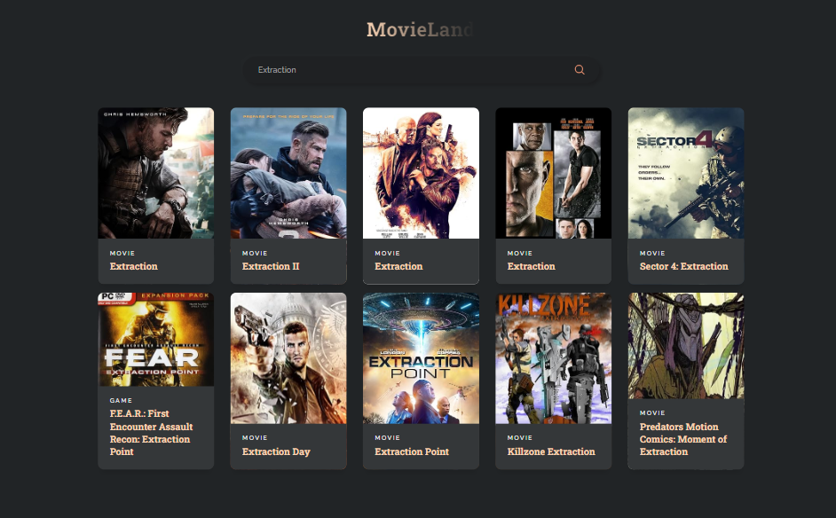

# MovieLand React App

### Description

Movie Land is a beautifully designed, fully responsive app built with React.js. It allows users to search for movies, fetches data from an API, and displays relevant results in an intuitive interface.

### Functionalities

It allows users to search for movies, fetches data from an API, and displays relevant results in an intuitive interface. The design is modern, responsive, and optimized for all devices, offering an exceptional browsing experience for discovering and exploring movies.
